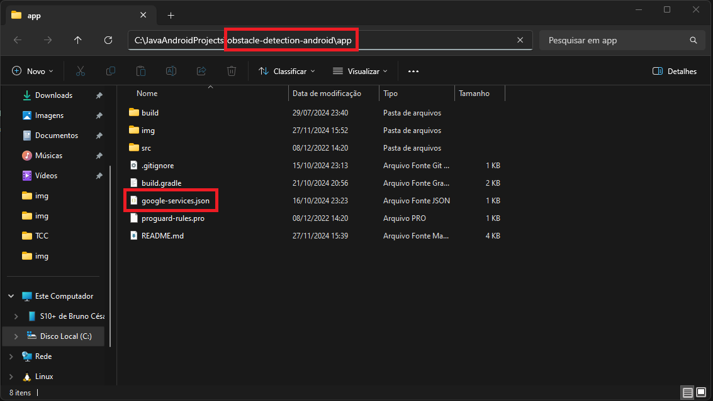

# Configuração do Firebase e Credenciais

- Primeiramente, siga o passo a passo descrito em: https://github.com/brunocduran/obstacle-detection/tree/main/credenciais

- No menu do Firebase, vá em adicionar seu aplicativo **Android**:

- Preencha com as seguintes informações e clique em **Registrar app**:

- Faça o download do arquivo de configurações e clique em **Próxima**:

- Após o passo anterior, será baixado um arquivo **JSON**. Esse arquivo deve ser copiado para a pasta **app**, localizada na raiz do projeto, no diretório: *obstacle-detection-android\app*:

- Voltando ao Firebase, na parte de adicionar o plug-in e os SDKs, apenas clique em **Próxima**:

- Para finalizar, apenas clicar em **Continuar no console**:

